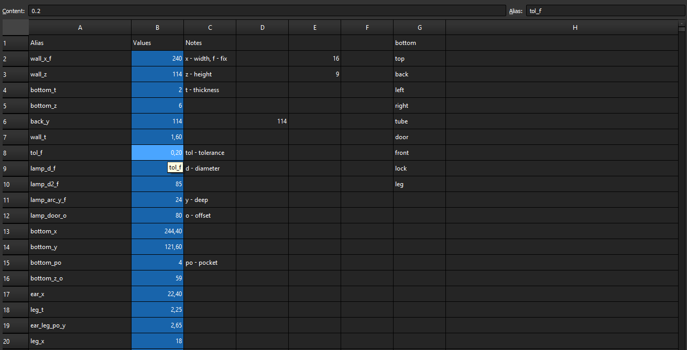
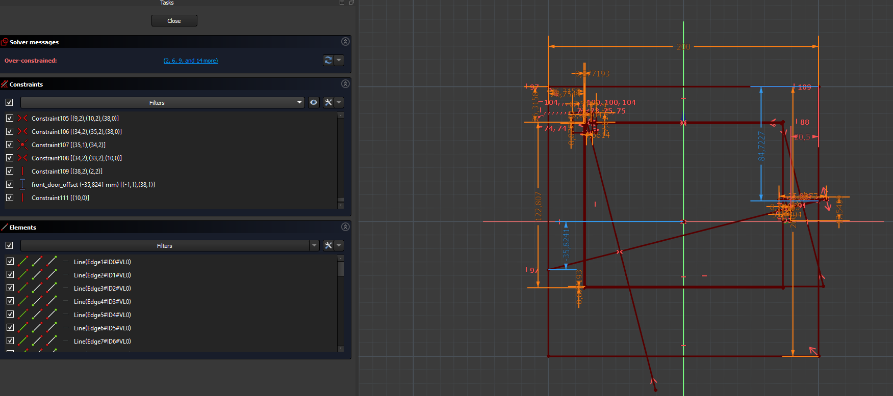
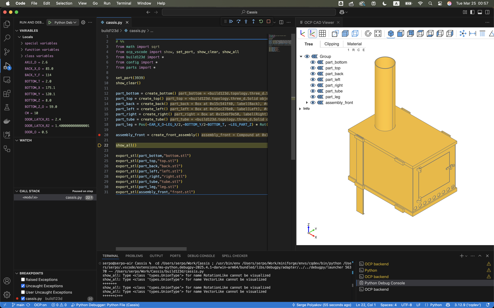
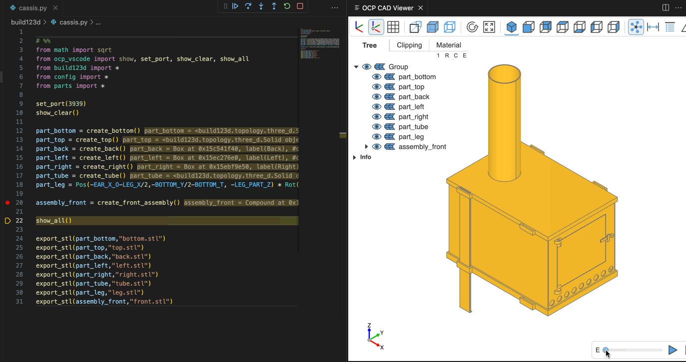

= Cassis – decorative lamp as tent camping stove

== Goal

I'm newbie in 3D so goal of this project is to try, feel and understand different modeling technics.

== Idea

As a first experience, I decided to design a decorative lamp in the form of a winter tent stove with the code name "Cassis".

image::pic/proto1.png[]
.These photos were used as inspiration
image::pic/proto2.png[]

The design of the product is elementary and easily imagined even without modeling experience.
The bottom of the stove, to which the battery and light block is attached.
The top, which repeats the dimensions of the bottom, but differs only in the presence of a hole for the pipe.
Solid and identical side walls on the left and right.
The back wall and the most interesting front side with a door.
The pipe and 4 identical legs.

Interchangeable translucent parts are installed inside the stove to create different lighting effects.
For instance can be used https://shop.thehueforge.com/pages/examples[HueForge technology] for stained glass and lithophanes.

A block from another lamp will serve as the light source - sizes for the mount will be parameters of the project.
I used https://www.ozon.ru/product/fonar-dekorativnyy-navigator-93-213-nsl-06-chernyy-plastik-steklo-na-batareykah-593821492/[block from this lamp].

Looking ahead, this is the lamp that resulted:

.FreeCAD version of Cassis
image::pic/cassis.png[]

.Printed and Assembled Cassis
image::pic/cassis.gif[]

== FreeCAD

I must admit that prototype xref:oven.blend[had been built in Blender initially], but it was obvious that the tool was chosen incorrectly.
It is just very good (almost perfect) example of open source software in 3D area.

Next step was about parametric CAD and open source choice is obvious as well - FreeCAD.

When everything is done correctly, the solution turns out beautiful.
No repetitions – DRY (Don't Repeat Yourself).
The solution should be as simple and concise as possible – KISS (Keep It Simple, Stupid!).

Ideally, it should be possible to enter the main product parameters in an online form and get the finished parts for assembly.
Something similar to the https://gridfinity.perplexinglabs.com/[Gridfinity automatic model generator].

[NOTE]
FreeCAD's Python API should enable this scenario in the future.

I'd like to follow best practices of FreeCAD modeling so I reviewed https://wiki.freecad.org/Tutorials[tutorials in the Modeling Parts section].

I will start determining the dimensions and proportions starting from bottom of the stove.

Where to define these parameters?

=== Source

When designing information systems, it is important to ensure that all data is stored in a single source.
Obviously, the approach here should be the same.

[NOTE]
The first thought was to use Google Sheets as a repository of reference information, where there were already sketches of product parameters.
There is a familiar and rich functionality and data is available through the REST API.
However, the necessary FreeCAD integration was not found.
Probably someone will develop such functionality later.

FreeCAD has its own https://wiki.freecad.org/Spreadsheet_Workbench[simple analogue of a spreadsheet], in which you can write out all the parameters and link them with formulas.
I will use it, although I sorely miss the usual sorting, filtering and basic formatting capabilities.

.Table with all parameters

=== Approach

The most advanced modeling tool in FreeCAD is the https://wiki.freecad.org/PartDesign_Workbench[Part Design Workbench].
I aimed to use it right away.
However, where it was sufficient to use simpler, preceding tools – I wanted to use them.

For this reason, I went through the lessons on the https://wiki.freecad.org/Draft_Workbench[Draft] & https://wiki.freecad.org/Part_Workbench[Part Workbench] tools.
However, when I tried to make a sketch as Draft or use modeling with the union and subtraction of primitives for this product – everything worked out, but it was clear that Sketches made it more elegant.

Therefore, I decided to do everything in the Part Design Workbench.
For each component, create a https://wiki.freecad.org/PartDesign_Body[separate body] in the FreeCAD project structure – bottom, top, back, left, right, tube, leg.
Front component will be a https://wiki.freecad.org/Std_Part[composite multi-body part].

=== Assembly

In theory, you still need to create an https://wiki.freecad.org/Assembly_Workbench[assembly] in which all components are combined.
Creating an assembly does not take long, although I am not sure if it will be useful here.

It will be possible to add 4 identical legs to the assembly, or somehow improve the connections of the parts in the future.

And you need to start drawing the main elements of the structure.

=== Naming

From the very first sketch, it becomes clear that, despite the simplicity of the product, it will have about a hundred parameters and you need to somehow agree with yourself on the naming format of all values.
And despite the fact that FreeCAD generates names with a numeric suffix, it is better to name them yourself and meaningfully.

I decided to use the formatting format that is used in Python - all letters in the name are lowercase and "_" is used as a separator.
The prefix of each element means the used tool or the type of part:

* po_ - pocket;
* pa_ - pad;
* mt_ - multi transform;
* binder_

Next is the name of the part - door, top, tube.
And finally, a suffix with the parameter type:

* _x - value on the X axis, width
* _z - Z axis, height
* _y - Y axis, depth
* _t - thickness
* _r - radius
* _d - diameter
* _o - offset

There were about 70 parameters for the first project and these rules were quite enough.

=== Master sketches

After completing the lesson on creating a https://wiki.freecad.org/Sketcher_Workbench[Sketch], modeling with a reduction in the number of degrees of freedom resembles a gaming.
In which the inscription Fully Constrained means Level Complete :-)

.Master sketch for the bottom of the stove
image::pic/master_bottom.png[]

[NOTE]
I used the best practices for defining Constraints from the description, although I clearly need to thoroughly study the https://forum.freecad.org/viewtopic.php?f=36&t=30104[80-page lecture].

=== SubShapeBinder

Next, for each body I have to create a https://wiki.freecad.org/PartDesign_SubShapeBinder[SubShapeBinder], which, in turn, is created on the basis of the master sketch.
I hope I understood the main idea correctly.
Although I have not found from scratch a thorough and simple training lesson on the general approach to modeling products like this.

After the first transformations of the bottom, which are common with the top part, I defined the second SubShapeBinder.
In order to make a lid on its basis and without repetition.

[NOTE]
Everything worked out, although I'm not sure if this is the optimal solution to the problem.

=== Bindings, positioning and displacement

Then everything went elementarily by analogy.
Until I got to drawing the hinges on the door.
Here the first difficulty arose with placing the Sketch – how is it better?
To the binder? To the face or to the plane?

I'm not happy with the way it turned out.
Created Z Attachment offset for the value of reference distance between midpoint of the front panel and door.
There were difficulties with the tool when mirroring.
And now the hinges break when you change the size of the width of the stove. 
In addition, there is a persistent feeling that the drawings of the front wall and the door should be further separated.
Not sure how to do it best.

.Master sketch of the front wall
image::pic/master_front.png[]

[NOTE]
I would like to hear the opinion of experts on this matter.
Too many parameters visually look ugly, and this should not be the case.

=== Primitives

For modeling the latch, it seemed excessive to me to use the Part Design tools based on sketches.
With a cone primitive, which was subtracted from the door and added to the latch, the solution looked simpler.

[NOTE]
Although I'm not sure and would like an outside opinion :/

== FreeCAD's result

As a result, everything worked out.

xref:Cassis.FCStd[Cassis.FCStd] - FreeCAD project.

When changing the main parameter – the width of the stove, the entire project is recalculated.

This makes it possible to create such lamps in any size, for any LEDs.
Good, but..

== Remaining questions...

- Some of the dimensions created in the table are probably not used – how to quickly check?
- Should I have increased the number of master Sketches in this case to simplify them?
- Is the use of SubShapeBinder justified in such scenarios and in such quantities?
- To temporarily hide some tool processing – I checked Suppressed (which does not work yet) and set the main parameter of the tool to 0 – is there a better way?
- Applying the Fillet tool as the final transformation step seriously slows down the work with model.
Seems I have to put Fillet after Tip feature.
Can I somehow disable the calculation for drawing, but use it during export to STL?
- In the reference master drawings, which are used for external geometry in several parts, not all profiles are closed.
But this does not correspond to best practices.
Is this a normal exception to the rules or is it still unacceptable?
- I constantly renamed Origin to the name of the Body, so as not to get confused in the representations.
Can I make the name of the Body coordinates use its name by default?

== What's next?

- Answer above questions and problems 
- Try to implement the generation and export of parts using a Python script
- It would be interesting to generate a stained glass backlight pattern using AI

== OpenSCAD and alternatives

I've solved first problem from the questions' list above and used xref:fc_unused.py[Python script] to determine unused variables.
But while I tried to answer following questions and solve problems I had to redraw sketches.
Very quickly these sketches became unreadable :-/

.Mess in sketches

While reading forums about similar problems I wanted to made a try to model the same project using OpenSCAD.
Tutorial was very easy to understand and follow.
But even in the beginning is absolutely clear that:

- OpenSCAD dialect is very narrow standard
- Kernel is quite slow and has serious limitations
- Code editor is far from being so comfortable and modern as VS Code

So, I continued to search and found https://github.com/gumyr/build123d[open source Build123d framework].

== Seems that Build123d is my CAD modeling approach

Examples of completed modelings were impressive.
Code of Algebra mode was especially dry and beautiful on my taste.

Process of modeling from the scratch after tutorials was easy.

xref:build123d[Resulting code is very small]. 
It's still not optimized, so I'm pretty sure that it can be much more elegant.
Modeling with Jupiter Notebook and OCP CAD Viewer is the best experience for me.
I can do it without mouse, laying on the coach with Mac Air :-)

.Build123d in action

.Build123d in action

