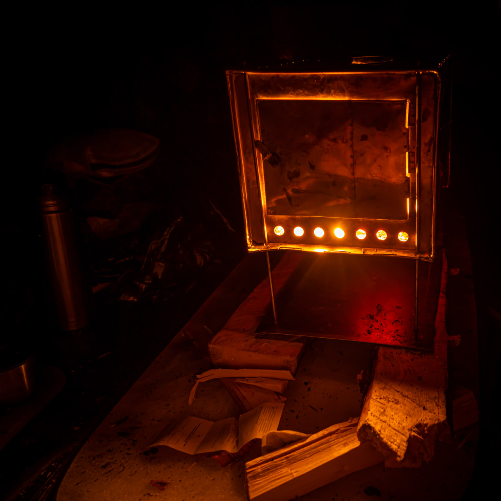
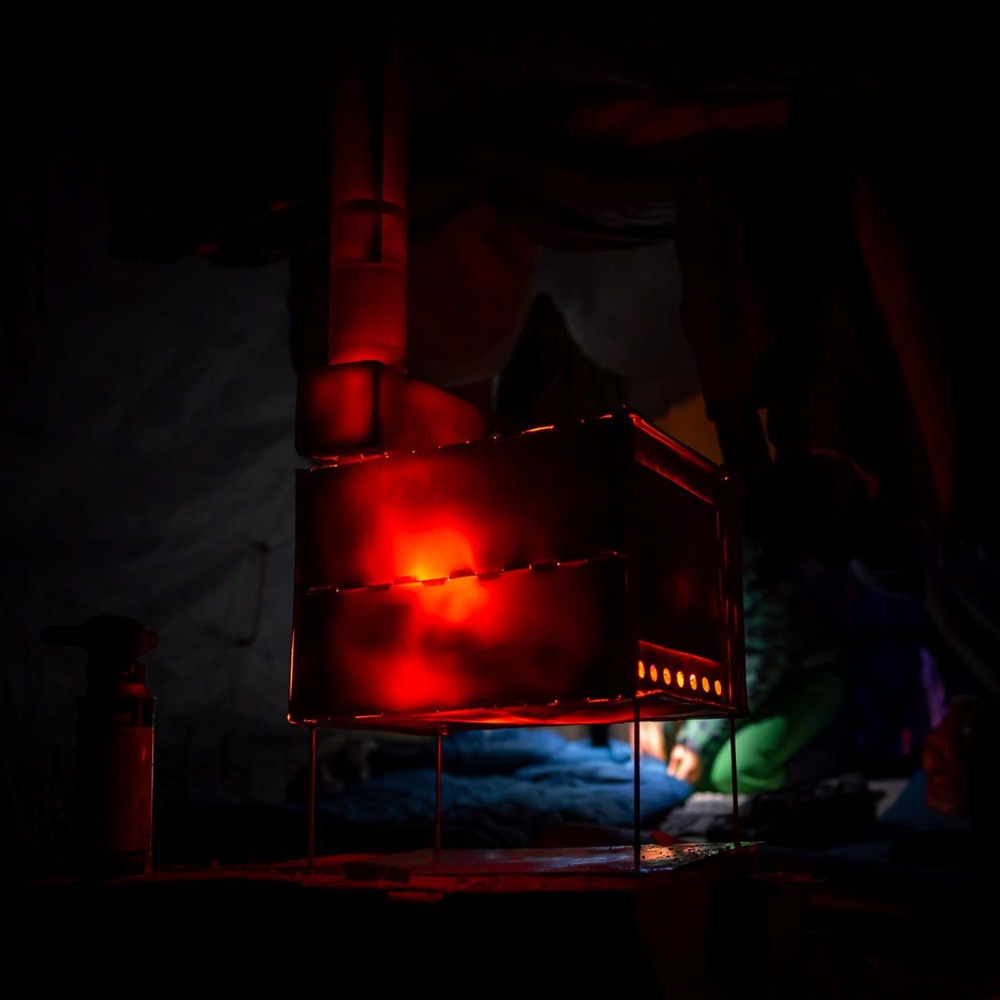
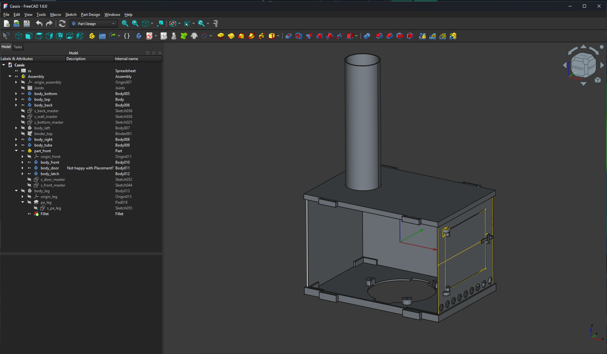
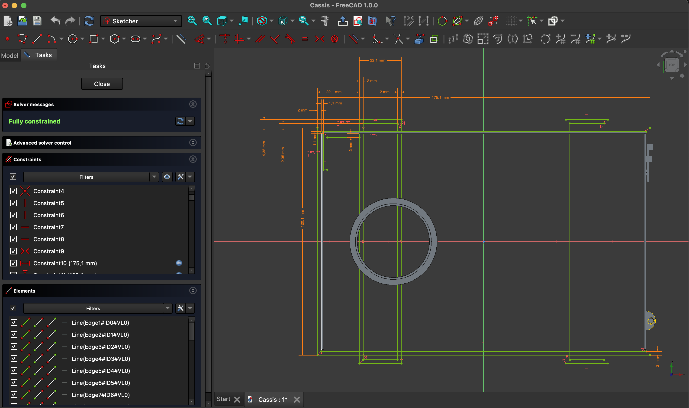
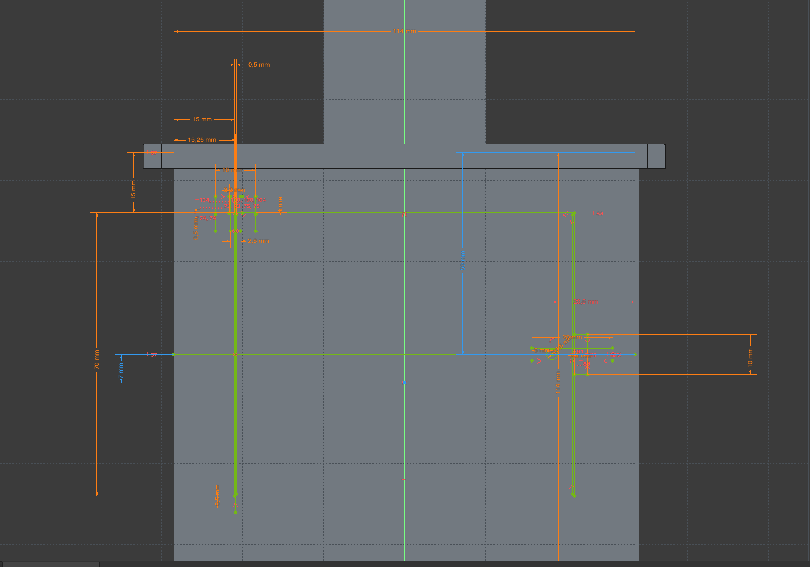

= Светильник-печка "Cassis"

== Задача

Это первый опыт моделирования многотельного изделия в параметрическом CAD - FreeCAD.
Перед созданием были просмотрены https://wiki.freecad.org/Tutorials[обучающие из раздела Modeling Parts].

Основная задача этого проекта - разобраться в FreeCAD на практическом примере и при этом использовать лучшие подходы.
Надо признаться, что до этого проект был собран в Blender, но было очевидно, что инструмент выбран неправильно.
Поэтому во FreeCAD сразу хотелось сделать основательно.

Когда сделано всё правильно, то и решение получается красивым.
Отсутствуют повторения – DRY.
Don't Repeat Yourself
Решение должно быть максимально простым и лаконичным – КISS.
Keep It Simple, Stupid!

И в пределе это может означать, что можно будет ввести основные параметры изделия в online форме - и получить готовые детали для сборки.
Что-то аналогичное https://gridfinity.perplexinglabs.com/[автоматическому генератору моделей Gridfinity].

[NOTE]
Наличие Python API у FreeCAD должно обеспечивать и такой сценарий впоследствии.

== Идея

В качестве первого опыта решено спроектировать декоративный светильник в виде зимней палаточной печки с кодовым названием "Cassis".

.В качестве вдохновения были использованы эти фотографии

Внутрь печки можно будет устанавливать полупрозрачные сменные детали для создания разных световых эффектов.
Например, с использованием https://shop.thehueforge.com/pages/examples[технологии HueForge] для витражей и литографии.

В качестве источника света подойдет блок от другого светильника - параметры крепления этого блока будут фиксированными.
Например, https://www.ozon.ru/product/fonar-dekorativnyy-navigator-93-213-nsl-06-chernyy-plastik-steklo-na-batareykah-593821492/[такого].

Забегая вперёд – получился такой светильник:

.FreeCAD версия проекта Cassis

.Cassis распечатан и собран
image::pic/cassis.gif[]

== Моделирование

Конструкция изделия элементарна и легко представляется в голове.
Даже без опыта проектирования.
Дно печки, в которое крепится блок с батарейками и светом.
Повторяющее по размерам крышка, которая отличается лишь наличием отверстия для трубы.
Глухие и идентичные стенки слева и справа.
Задняя стенка и наиболее интересная лицевая сторона с дверцей.
Труба и 4 одинаковые ножки.

Буду начинать определение размеров и пропорций со дна печки.

Где определять параметры?

=== Источник

При проектировании информационных систем важно обеспечить хранение всех данных в едином источнике.
Явно, что здесь подход должен быть такой же.

[NOTE]
Первая мысль была о том, чтобы в качестве хранилища справочной информации использовать Google Sheets, где уже были наброски параметров изделия.
Там привычный и богатый функционал и данные доступны через REST API.
Однако необходимой интеграции не нашлось.
Вероятно такой функционал кто-то разработает позже.

FreeCAD обладает https://wiki.freecad.org/Spreadsheet_Workbench[собственным простым аналогом электронной таблицы], в которой можно выписать все параметры и связать их формулами.
Буду использовать его, хотя ощутимо не хватает привычной сортировки, фильтрации и базовых возможностей оформления.

.Таблица со всеми параметрами
image::pic/ss.png[]

=== Подход

Наиболее продвинутым инструментом моделирования FreeCAD является https://wiki.freecad.org/PartDesign_Workbench[Part Design Workbench].
Целился сразу в его использование.
Однако там, где достаточно было использовать более простые, предшествующие инструменты – хотел применять их.

По этой причине прошёл уроки по инструментам https://wiki.freecad.org/Draft_Workbench[Draft] & https://wiki.freecad.org/Part_Workbench[Part Workbench].
Однако когда попробовал сделать для этого изделия набросок в Drafts или использовать моделирование с соединения и вычитания примитивов – всё получалось, но было понятно, что с помощью чертежей Sketches получается элегантнее.

Поэтому решил всё делать в Part Design Workbench.
Для каждого компонента сделать в структуре проекта FreeCAD https://wiki.freecad.org/PartDesign_Body[отдельное тело] – bottom, top, back, left, right, tube, leg.
А вот front будет https://wiki.freecad.org/Std_Part[составной многотельной деталью].

=== Сборка

По уму, надо ещё создать https://wiki.freecad.org/Assembly_Workbench[сборку], в которой объединены все компоненты.
Создать сборку недолго, хотя не уверен, что будет польза.

Можно будет добавить в сборку 4 однотипных ножки, ну или как-то улучшить соединения деталей в перспективе.

И надо приступать к черчению основных элементов конструкции.

=== Именование

С первого же наброска становится понятно, что, несмотря на простоту изделия, в нём будет порядка сотни параметров и нужно как-то договориться с самим собой о формате именования всех значений.
И несмотря на то, что FreeCAD генерирует названия с численным суффиксом, лучше их именовать самостоятельно и осмысленно.

Решил использовать формат оформления, который используется в Python - все буквы в названии строчные и в качестве разделителя  "_".
Префикс каждого элемента означает операцию преобразования или тип детали:

* po_ - pocket;
* pa_ - pad;
* mt_ - multi transform;
* binder_

Далее название детали - door, top, tube.
И в завершении суффикс с типом параметра:

* _x - значение по оси Х, ширина
* _z - оси Z, высота
* _y - ось Y, глубина
* _t - thickness
* _r - radius
* _d - diameter
* _o - offset

Параметров получилось порядка 70 штук для первого проекта и этих правил вполне хватило.

=== Мастер чертежи

После прохождения урока по созданию https://wiki.freecad.org/Sketcher_Workbench[Sketch] отрисовка чертежа с сокращением количества степеней свободы скорее напоминает игру.
В которой надпись Fully Constrained означает Level Complete :-)

.Мастер sketch для дна печки создан.

[NOTE]
Использовал лучшие практики определения Constraints из описания, хотя явно надо досконально изучить https://forum.freecad.org/viewtopic.php?f=36&t=30104[лекцию на 80 страниц].

=== SubShapeBinder

Далее для каждого body нужно создавать https://wiki.freecad.org/PartDesign_SubShapeBinder[SubShapeBinder], который, в свою очередь, создаётся на основе мастер sketch.
Надеюсь, что я правильно понял основную идею.
Хотя обстоятельного и простого обучающего урока по общему подходу в моделировании я не нашёл.

После первых преобразований днища, которые являются общими с верхней деталью, я выделил второй SubShapeBinder.
Для того, чтобы уже на его основе и без повторения сделать крышку.

[NOTE]
Всё получилось, хотя я не уверен, что это оптимальное решение задачи.

=== Привязки, позиционирование и смещение

Дальше всё шло элементарно по аналогии.
До тех пор как дошёл до отрисовки петель на двери.
Тут возникло первое затруднение с размещением Sketch – как лучше?
К binder? К поверхности или к плоскости?

То, как получилось, скорее не устраивает.
Были сложности с инструментом при зеркалировании петель.
И сейчас петли ломаются при изменении размера ширины печки. 
Кроме того, устойчивое ощущение, что чертежи фронтальной стенки с дверью стоило бы ещё больше разделить.

.Мастер чертёж фронтальной стенки

[NOTE]
Хочется услышать мнение экспертов по этому поводу.
Слишком много параметров визуально выглядят некрасиво, а так быть не должно.

=== Примитивы

Для моделирования щеколды мне показалось избыточным использование функции преобразования на основе чертежей.
С примитивом конуса, которые вычитался из дверцы и добавлялся к щеколде решение выглядело проще.

[NOTE]
Хотя не уверен и хотелось бы стороннего мнения :/

== Результат

В результате всё получилось.

xref:Cassis.FCStd[Cassis.FCStd] - FreeCAD проект.

При изменении основного параметра – ширина печки, пересчитывается весь проект.

Это даёт возможность создавать такие светильники в любых размерах, под любые LED-лампы.
Прекрасно!

== Оставшиеся вопросы

- Часть измерений созданных в таблице, вероятно, не используются – как быстро проверить?
- Стоило ли увеличивать в этом случае количество мастер чертежей для их упрощения?
- Обосновано ли использование SubShapeBinder в таких сценариях и в таком количестве?
- Чтобы временно скрыть отработку преобразования – выделял Suppressed (который пока не работает) и выводил параметр в 0 – есть ли способ лучше?
- Наложение фаски Fillet финальным шагом преобразования серьёзно тормозит работу с чертежами.
Можно ли как-то отключать обсчёт для отрисовки, но использовать во время экспорта в STL?
- В опорных мастер чертежах, которые используются для внешней геометрии в нескольких деталях, не все профили замкнутые.
Но это не соответствует лучшим практикам.
Это нормальное исключение из правил или всё таки недопустимо?
- Постоянно переименовывал Origin под название Body, чтобы не путаться в представлениях.
Может сделать так, чтобы название координат Body использовало его название?

== Что дальше?

- Попробовать реализовать генерацию и экспорт деталей с помощью Python скрипта
- Интересно сделать генерацию рисунка подсветки витража с использованием ИИ

xref:README.adoc[English]